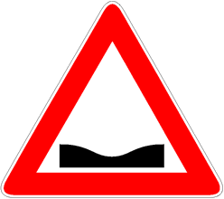

Una cunetta segnala praticamente l'opposto di un
[dosso](./2020-12-08t09-21-09z.md): un tratto in discesa seguito da uno in
salita. Spesso è accompagnato da un segnale di
[possibile allagamento](./2020-12-09t21-48-27z.md).

È necessario

- moderare la velocità
  - evitando danni alla [sospensione](./2020-12-09t21-52-15z.md)
- prevedere la possibilità di accumulo di fango e detriti nella cunetta.
