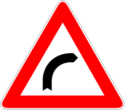

Presegnala (a circa 150m) una curva caratterizzata da scarsa visibilità. A volte
accompagnato dalla [scritta 'TORNANTE'](./2020-12-09t21-59-16z.md).

È necessario

- circolare il più vicino possibile al margine destro in caso di carreggiata a
  due corsie a doppio senso
- usare più attenzione se la strada è bagnata
- regolare la velocità in relazione alla
  - visibilità
  - raggio di curva
  - stato di usura dei pneumatici
  - condizioni di carico del veicolo

È vietato

- sorpassare
  - che però è consentito se
    - la strada è a senso unico
    - o a due corsie per ogni senso di marcia
    - o a carreggiate separate
- fare retromarcia
- inversione di marcia
- fermarsi
- sostare
