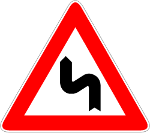

Presegnala un tratto di strada 'doppia curva' ossia due curve consecutive in
direzioni opposte. Può essere accompagnata da un panello di ESTESA o uno
indicante [TORNANTI](./2020-12-09t21-59-16z.md).

È necessario comportarsi come in presenza del
[segnale verticale di curva](./2020-12-09t21-53-51z.md)
