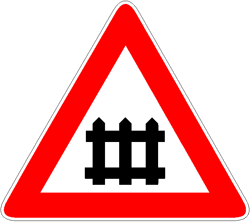
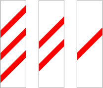

Presegnala un attraversamento ferroviario protetto da barriere (sbarre che
occupano l'intera strada) o semibarriere (sbarre che occupano sono la corsia di
marcia rispettiva).

È regolamentare trovare sulla pavimentazione una croce di S. Andrea con le
lettere PL per segnalare il passaggio a livello.

---

Il segnale è accompagnato da tre pannelli distanziometrici, che indicano il
progressivo avvicinamento del passaggio a livello tramite il disegno di barre
rosse.

Il pannello distanziometrico a 3 barre rosse è posto 150 metri, quello a 2 a 100
metri e quello con 1 barra rossa è posto a 50 metri dall'incrocio.

---

Negli incroci ferroviari dotati di barriere, la chiusura viene segnalata da un
segnale acustico a campana e da un segnale luminoso rosso fisso.

Negli incroci ferroviari dotati di semibarriere, la chiusura è invece segnalata
da un segnale acustico e due luci rosse lampeggianti alternanti.

---

È necessario

- moderare la velocità
- arrestarsi se sono in funzione le luci

È vietato

- impegnare il passaggio a livello se traffico intenso impedisce di sgomberarlo
- la fermata e la sosta in corrispondenza/prossimità
- il sorpasso se privo di semaforo

Nel caso in cui ci si trovi ancora sui binari quando le barriere cominciano a
chiudersi occorre:

- mantenere la calma
- sgomberare in qualsiasi modo la sede ferroviaria, anche al costo di sfondare
  le barriere.
- in causo di guasto alla propria vettura
  - spingere o trainare il veicolo con l'aiuto di altri utenti
  - presegnalare il pericolo ad eventuali treni in transito
