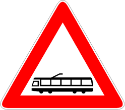

Presegnala la presenza di una via tranviaria non regolata da semafori.

È necessario

- moderare la velocità

È consentito

- il sorpasso a destra del tram in marcia
- il sorpasso a sinistra entro la propria corsia con il tram fermo
- circolare sui binari se non si intralcia la marcia del tram

Ricordarsi

- che il tram richiede una distanza di arresto maggiore degli altri autoveicoli.
