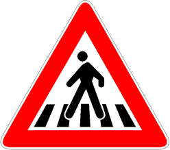

Presegnala a 150 metri un attraversamento pedonale.

È necessario

- rallentare e fermarsi

È vietato

- tentare di superare un'auto che rallenta o si ferma in prossimità del segnale
- effettuare la sosta o la fermata sulle strisce.

Qualora non si dia la precedenza ai pedoni, si incorre nella sottrazione di
punti della patente.

In assenza di strisce, se un pedone non accenna di darci la precedenza è
comunque necessario ridurre la velocità, avvisarlo del nostro passaggio e
fermarsi tempestivamente per non investirlo.
