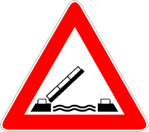

Presegnala la presenza di un ponte mobile. Può essere accompagnato da un
pannello distanziometrico e luci rosse alternanti come nei
[passaggi a livello](./2020-12-10t21-49-41z.md).

È necessario

- moderare la velocità
- fermarsi con segnalazioni di pericolo in funzione (doppie frecce).
