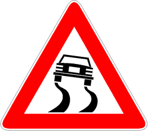

Presegnala un tratto di strada caratterizzato da superficie con poca aderenza e
quindi viscido e scivoloso. Viene integrato da pannelli illustranti dei motivi
della sdrucciolevolezza.

È necessario

- moderare la velocità
- evitare manovre brusche
- aumentare la distanza di sicurezza
