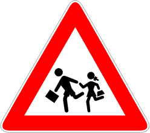

Presegnala la presenza di luoghi frequentati da bambini, e.g. scuole.

È necessario

- stare molto attenti nel caso di attraversamento di bambini
- moderare la velocità
- fermarsi se necessario
- considerare comportamenti imprudenti da parte dei bambini.

È vietato

- sorpassare
