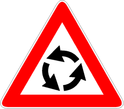

Presegnala un incrocio di più strade extraurbane regolato con circolazione
rotatoria nel senso indicato nel segnale. Nei centri abitati viene utilizzato
solo se richiesto per motivi di sicurezza.

È necessario

- rallentare
- prestare attenzione agli altri veicoli
