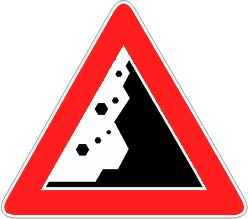

Presegnala la possibile presenza di pietre sulla carreggiata cadute dalla parete
rocciosa che fiancheggia la carreggiata.

È necessario

- rallentare
- evitare lunghe soste
- fare attenzione a brusche frenate da parte degli altri veicoli
