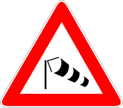

Presegnala un tratto di strada con forte vento laterale.

È necessario

- procedere con prudenza
- tenere saldamente il volante
- rallentare se a guida di un veicolo tendonato
- prestare attenzione a sbandamenti degli altri veicoli
