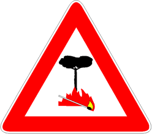

Presegnala l'attraversamento di una zona particolarmente esposta al pericolo di
incendio.

È accompagnato da un pannello che ne indica la lunghezza.

È vietato

- gettare dal finestrino
  - fiammiferi accesi
  - sigarette accese
- fermarsi su sterpi o erba secca
