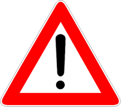

Presegnala un pericolo diverso da
[quelli per cui sono previsti segnali specifici](./2020-12-06t18-13-41z.md). Il
pericolo è comunque specificato nel pannello integrativo che accompagna
obbligatoriamente il segnale.

È necessario

- usare la massima prudenza
- moderare la velocità
- mantenere la distanza di sicurezza
- porre l'attenzione sia in lontananza che in vicinanza
- lasciare liberi gli sbocchi delle strade laterali
