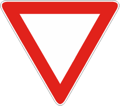

- Prescrive di dare la precedenza sia a destra che a sinistra.
- Sulle strade extraurbane è preceduto dal segnale 'PREAVVISO DI DARE
  PRECEDENZA'
- In genere è accompagnato dalla striscia
  [trasversale di dare precedenza](./2020-12-20t17-09-20z.md).

È necessario

- usare prudenza
- moderare la velocità

Da notare che non occorre fermarsi all'incrocio se rallentando si ha modo di
vedere che non vi sono veicoli in arrivo da ambi le parti.

## Preavviso di dare precedenza

Se accompagnato da un pannello integrativo di distanza, il segnale viene
interpretato come segnale di _preavviso_.
