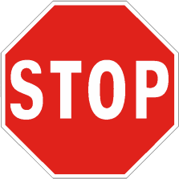

Obbliga di arrestarsi all'incrocio in corrispondenza della striscia trasversale,
dando la precedenza sia a destra che a sinistra.

Fuori dai centri abitati è preceduto dal
[segnale di preavviso](./2020-12-20t16-54-28z.md)
