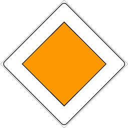

Segnale generico che segnala il diritto di precedenza. Viene posto all'inizio di
strade urbane, extraurbane o statali che godono del diritto sulle strade di
immissione, e può essere ripetuto.

È necessario

- moderare la velocità in prossimità di incroci
- accertarsi che la precedenza venga data come dovuto

La fine del diritto di precedenza viene eventualmente segnalata dal
[segnale di fine del diritto di precedenza](./2020-12-21t18-02-10z.md)
