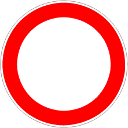

Vieta la circolazione a tutti i [veicoli](./2020-12-05t16-33-32z.md) nei due
sensi di marcia, venendo quindi posto su entrambe gli accessi alla strada. La
circolazione è invece consentita ai pedoni.
