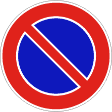

- Indica un lato di strada o le aree dove è vietato lasciare in
  [sosta](./2020-12-23t16-25-56z.md) un veicolo.
- La fermata è comunque consentita.
- Il segnale non è posto nei luoghi in cui generalmente già vige il divieto di
  sosta.
- Sulle strade urbane, è valido dalle 8:00 alle 20:00 salvo diversa indicazione.
- Sulle strade extraurbane, il divieto è permanente, salvo diversa indicazione.
- Cessa di validità al primo incrocio se non ripetuto.
- È anche usato per segnalare
  - il passo carrabile
  - la sosta consentita solo a particolari categorie (e.g. disabili)
  - sosta flessibile in base all'ora del giorno
  - divieti di sosta temporanei
