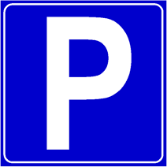

Segnala un' area autorizzata, attrezzata ed organizzata per il parcheggio dei
veicoli, ossia di una [sosta](./2020-12-23t16-25-56z.md).

Dopo aver parcheggiato, è importante controllare che non sopraggiungono altri
veicoli, particolarmente ciclisti, prima di aprire lo sportello per uscire dal
veicolo parcheggiato

Passando vicino ad una o più auto parcheggiate, è importante

- considerare l'apertura improvvisa degli sportelli
- considerare l'ostruzione visiva da parte della auto parcheggiate di pedoni.

Per quanto riguarda zone in cui la sosta è regolamentata con parchimetro non
occorre usarlo in caso di fermata.

I veicoli al servizio di persone diversamente abili non sono obbligati a
rispettare il limite di tempo stabilito per la sosta, se presente.
